# Docker Nexus Repository as a Private Docker Registry

<p align="center">


</p>

---

# Project Overview

This project demonstrates how to deploy and configure **Sonatype Nexus Repository Manager** as a **private Docker registry** in a local development environment using Docker.

The implementation covers the complete lifecycle of managing private container images—from deploying Nexus as a container, creating a Docker Hosted Repository, authenticating Docker clients, publishing container images, retrieving those images from the registry, and verifying successful deployments.

Container registries are a critical component of modern DevOps workflows. While public registries such as Docker Hub provide access to publicly available container images, many organizations require a private registry to securely store internally developed images, maintain version history, control access, and establish a trusted source for software artifacts.

In this project, Nexus Repository Manager serves as that trusted repository. Running entirely on a local Docker environment allows the complete workflow to be explored without requiring cloud infrastructure, making it an excellent platform for understanding enterprise container image management.

The repository documents every stage of the implementation, including deployment, configuration, authentication, image publishing, image retrieval, verification, troubleshooting, and operational best practices.

---

# Project Objectives

The primary objectives of this project are to:

* Deploy Sonatype Nexus Repository Manager as a Docker container.
* Configure Nexus as a private Docker registry.
* Create and configure a Docker Hosted Repository.
* Authenticate Docker clients with the private registry.
* Tag Docker images for private registry deployment.
* Push Docker images into Nexus Repository Manager.
* Pull Docker images from the private registry.
* Verify successful image deployment.
* Understand private registry workflows and artifact management.
* Document the implementation in a reproducible and professional manner.

---

# Why Use a Private Docker Registry?

Container images are valuable software artifacts that often contain proprietary application code and deployment configurations. Although Docker Hub is widely used for public image distribution, organizations frequently require an internal registry where access can be controlled and images can be managed throughout the software development lifecycle.

A private Docker registry provides several important advantages:

* Secure storage for proprietary container images.
* Centralized image management.
* Controlled authentication and authorization.
* Reliable version management.
* Consistent deployment artifacts across development, testing, and production environments.
* Reduced dependency on external registries.
* Improved software supply chain security.

Nexus Repository Manager fulfills these requirements while supporting many additional package formats, making it a common artifact repository in enterprise DevOps environments.

---

# What is Nexus Repository Manager?

Sonatype Nexus Repository Manager is a universal artifact repository that stores, manages, and distributes software packages and container images.

Although this project focuses on Docker images, Nexus also supports numerous package ecosystems including Maven, npm, NuGet, PyPI, Helm, and many others. This flexibility makes it a central component of many CI/CD pipelines.

Within this implementation, Nexus acts as a private Docker registry where authenticated Docker clients can publish, store, retrieve, and manage container images in a controlled environment.

---

# Public Registry vs Private Registry

| Feature               | Public Registry | Private Registry (Nexus) |
| --------------------- | --------------- | ------------------------ |
| Access                | Public          | Controlled               |
| Authentication        | Optional        | Required                 |
| Proprietary Images    | Not Recommended | Supported                |
| Version Management    | Yes             | Yes                      |
| Access Control        | Limited         | Granular                 |
| Enterprise Use        | Limited         | Excellent                |
| Internal Distribution | Limited         | Designed For It          |

---

# Project Architecture

```text
                     Developer
                          │
                          ▼
               Local Development Machine
                          │
                          ▼
                    Docker Engine
                          │
                          ▼
             Nexus Repository Manager
                          │
                Docker Hosted Repository
                    ┌──────────────┐
                    │              │
              Docker Push     Docker Pull
                    │              │
                    └──────┬───────┘
                           ▼
                   Docker Images
                           │
                           ▼
                Running Containers
```

This architecture demonstrates how Nexus Repository Manager serves as the centralized private registry for storing, distributing, and managing Docker images within a local containerized environment.

---

# Technologies Used

| Technology               | Purpose                     |
| ------------------------ | --------------------------- |
| Ubuntu Linux             | Operating System            |
| Docker Engine            | Container Runtime           |
| Docker CLI               | Image Management            |
| Nexus Repository Manager | Private Docker Registry     |
| Git                      | Version Control             |
| GitHub                   | Source Code Hosting         |
| Terminal                 | Command-Line Administration |

---

# Key Skills Demonstrated

This project demonstrates practical experience with:

* Docker container management
* Nexus Repository Manager
* Private Docker registries
* Docker image tagging
* Docker authentication
* Image publishing
* Image retrieval
* Software artifact management
* Linux administration
* DevOps documentation
* Troubleshooting containerized services
* Registry administration

---

# High-Level Workflow

```text
Deploy Nexus
      │
      ▼
Create Docker Hosted Repository
      │
      ▼
Authenticate Docker Client
      │
      ▼
Tag Docker Image
      │
      ▼
Push Image
      │
      ▼
Store Image in Nexus
      │
      ▼
Pull Image
      │
      ▼
Deploy Container
      │
      ▼
Verify Successful Deployment
```

This workflow represents the complete lifecycle of managing Docker images through a private registry hosted locally using Docker.

---

# Prerequisites

Before starting this project, ensure your local development environment meets the following requirements.

## Software Requirements

| Component     | Purpose                        |
| ------------- | ------------------------------ |
| Docker Engine | Run and manage containers      |
| Docker CLI    | Build and manage Docker images |
| Git           | Version control                |
| GitHub        | Repository hosting             |
| Web Browser   | Access the Nexus web interface |
| Terminal      | Execute Docker commands        |

---

## System Requirements

A modern computer capable of running Docker is sufficient for this project.

Recommended specifications:

* 64-bit operating system
* Minimum 4 GB RAM (8 GB recommended)
* Dual-core processor or better
* At least 10 GB of available disk space
* Stable internet connection (required for downloading Docker images)

---

# Repository Structure

```text
Docker-nexus-registry/
│
├── README.md
├── LICENSE
├── .gitignore
│
├── architecture/
│   └── architecture.drawio
│
├── docs/
│   ├── setup.md
│   ├── troubleshooting.md
│   └── lessons-learned.md
│
├── images/
│   ├── architecture.png
│   ├── docker-installation.png
│   ├── nexus-running.png
│   ├── nexus-login.png
│   ├── docker-hosted-repository.png
│   ├── docker-login.png
│   ├── docker-images.png
│   ├── docker-tag.png
│   ├── docker-push.png
│   ├── repository-images.png
│   ├── docker-pull.png
│   ├── container-running.png
│   └── cleanup.png
│
├── commands.md
└── video-script.md
```

Each directory is organized to separate documentation, architecture diagrams, screenshots, and supporting resources, making the repository easy to navigate and maintain.

---

# Local Development Environment

Unlike production environments where Nexus Repository Manager is commonly deployed on cloud infrastructure or dedicated servers, this implementation runs entirely on a local machine using Docker.

This approach provides an excellent learning environment because it reproduces the core workflow of an enterprise private registry without requiring cloud resources.

The local environment consists of:

* Docker Engine as the container runtime
* Nexus Repository Manager running inside a Docker container
* A persistent Docker volume for repository data
* Docker CLI for interacting with the registry
* A web browser for repository administration

---

# Local Architecture

```text
Local Machine
      │
      ▼
Docker Engine
      │
      ▼
Docker Container
      │
      ▼
Nexus Repository Manager
      │
      ▼
Docker Hosted Repository
      │
      ├──────────────┐
      ▼              ▼
docker push     docker pull
      │              │
      └──────┬───────┘
             ▼
       Docker Images
```

The Docker Engine hosts the Nexus container, while Nexus provides the private registry that stores and distributes Docker images.

---

# Implementation Overview

The project follows the same workflow commonly used in enterprise environments for managing container images.

```text
Verify Docker Installation
          │
          ▼
Create Persistent Storage
          │
          ▼
Deploy Nexus Repository Manager
          │
          ▼
Access Nexus Web Interface
          │
          ▼
Complete Initial Configuration
          │
          ▼
Create Docker Hosted Repository
          │
          ▼
Authenticate Docker Client
          │
          ▼
Tag Docker Image
          │
          ▼
Push Image
          │
          ▼
Verify Repository Contents
          │
          ▼
Pull Image
          │
          ▼
Run Container
```

Each step builds on the previous one, resulting in a fully functional private Docker registry capable of securely storing and distributing container images.

---

# Step 1: Verify Docker Installation

Before deploying Nexus Repository Manager, verify that Docker is installed and functioning correctly.

Display the installed Docker version.

```bash
docker --version
```

Display detailed Docker system information.

```bash
docker info
```

Successful output confirms that both the Docker CLI and Docker daemon are available.

---

```text
images/docker-installation.png
```

<p align="center">

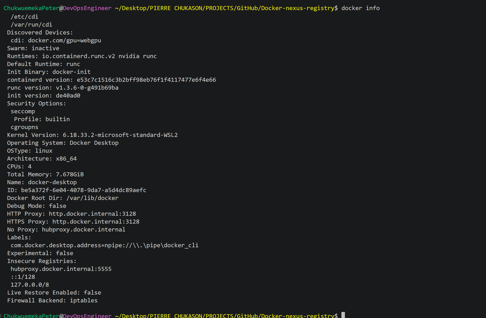

</p>

---

# Why Run Nexus in Docker?

Running Nexus Repository Manager inside a Docker container provides several operational advantages.

* Consistent deployment across environments
* Simple installation
* Easy upgrades
* Process isolation
* Portable configuration
* Simplified maintenance
* Persistent data using Docker volumes

Containerizing infrastructure services is a widely adopted DevOps practice because it improves repeatability and reduces configuration drift between environments.

---

# Step 2: Create Persistent Storage

Nexus stores repository metadata, configuration, and uploaded artifacts. To ensure this data survives container recreation, create a dedicated Docker volume.

```bash
docker volume create nexus-data
```

Verify that the volume has been created.

```bash
docker volume ls
```

Using a named volume separates application data from the container lifecycle, allowing Nexus to retain its configuration and stored images even if the container is removed or recreated.

---

```text
images/nexus-volume.png
```

<p align="center">

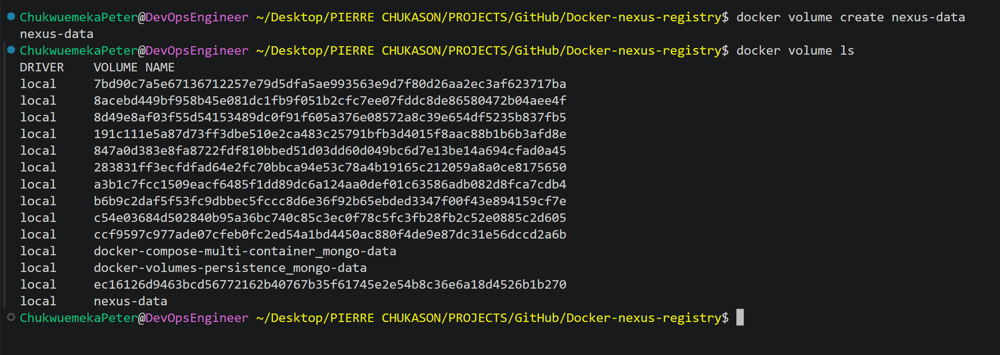

</p>

---

# Step 3: Deploy Nexus Repository Manager

Deploy Nexus as a Docker container.

```bash
docker run -d \
  --name nexus \
  -p 8081:8081 \
  -v nexus-data:/nexus-data \
  sonatype/nexus3
```

This command performs the following tasks:

* Creates a new container named `nexus`
* Maps port **8081** from the container to the local machine
* Mounts the persistent Docker volume
* Starts Nexus in detached mode

Verify that the container is running.

```bash
docker ps
```

If the container appears in the output, the deployment has completed successfully.

---

```text
images/nexus-running.png
```

<p align="center">

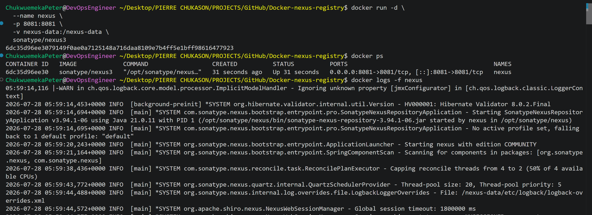

</p>

---

```text
images/nexus-running.png
```

<p align="center">

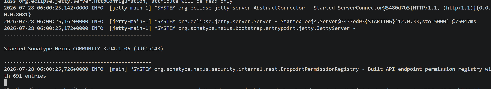

</p>

---

---

# Deployment Architecture

```text
Docker Engine
      │
      ▼
Nexus Container
      │
      ▼
Docker Volume
 (nexus-data)
```

The Docker volume stores all repository data independently of the container itself, ensuring persistence across container restarts, upgrades, and recreation.

---

# Step 4: Access the Nexus Web Interface

After deploying the Nexus container, the next step is to access its web-based administration interface.

Open your preferred web browser and navigate to:

```text
http://localhost:8081
```

During the first startup, Nexus initializes its internal services, creates the default configuration, and prepares the embedded database. This initialization process may take several minutes depending on your system resources.

If the page does not load immediately, wait a few minutes and refresh the browser.

---

```text
images/nexus-login.png
```

<p align="center">

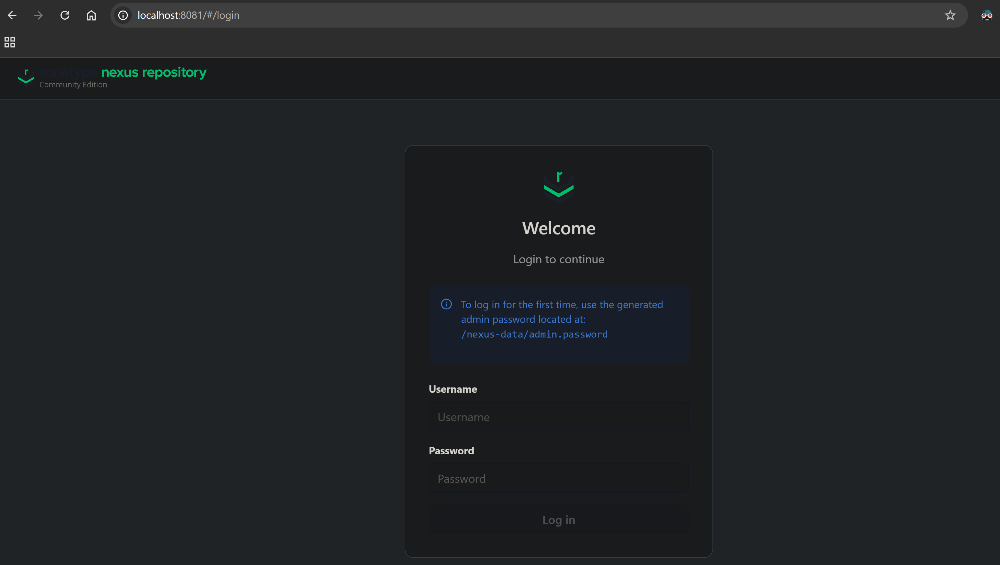

</p>

---

# Step 5: Retrieve the Initial Administrator Password

For security reasons, Nexus generates a temporary administrator password during its first startup. The password is stored inside the persistent data directory.

Retrieve it by running:

```bash
docker exec nexus cat /nexus-data/admin.password
```

The command returns the temporary password that will be used for the initial login.

Default username:

```text
admin
```

Password:

```text
<output from admin.password>
```

After signing in, Nexus prompts you to create a new administrator password before continuing.

---

```text
images/admin-password.png
```

<p align="center">

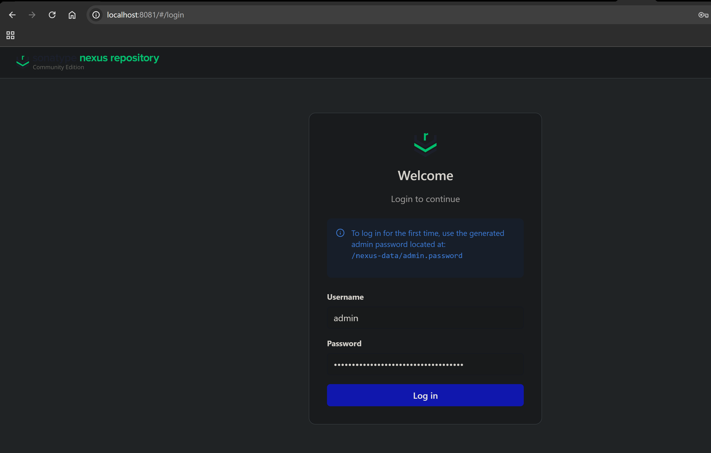

</p>

---

# Step 6: Complete the Initial Configuration

Once authenticated, complete the initial setup wizard.

Typical tasks include:

* Changing the default administrator password
* Choosing whether to enable or disable anonymous access
* Completing the initialization wizard

After the setup process finishes, the Nexus dashboard becomes available.

---

```text
images/nexus-dashboard.png
```

<p align="center">

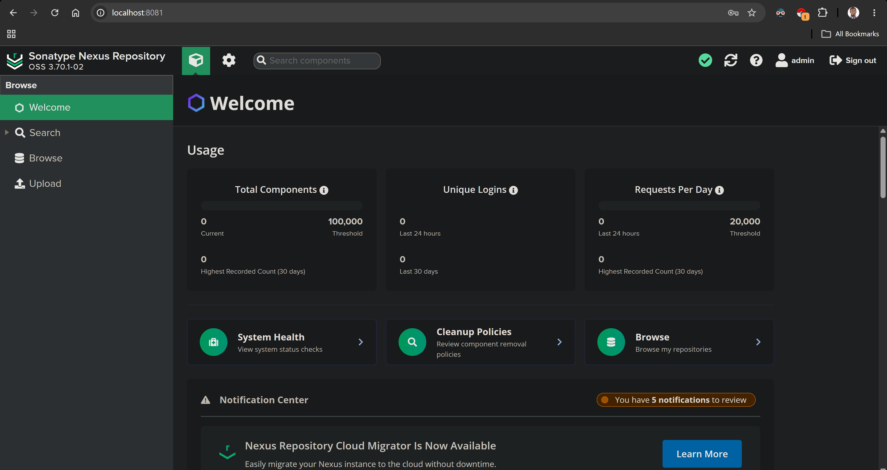

</p>

---

# Understanding the Nexus Dashboard

The Nexus web interface provides centralized administration for repositories and software artifacts.

Some of the major components include:

* Repositories
* Security
* Users
* Roles
* Blob Stores
* Tasks
* System Information

Although Nexus supports many repository formats, this project focuses on configuring and managing a **Docker Hosted Repository**.

---

# Step 7: Create a Docker Hosted Repository

A hosted repository stores Docker images that you publish from your local machine.

From the Nexus dashboard, navigate to:

```text
Repositories
        │
        ▼
Create Repository
        │
        ▼
Docker (Hosted)
```

Configure the repository with settings similar to the following:

| Setting           | Recommended Value                                  |
| ----------------- | -------------------------------------------------- |
| Repository Name   | docker-hosted                                      |
| Recipe            | Docker (Hosted)                                    |
| Deployment Policy | Allow Redeploy (or according to your requirements) |
| Blob Store        | Default                                            |
| HTTP Connector    | Enabled                                            |
| HTTP Port         | 8083 (or your configured port)                     |

Save the repository after completing the configuration.

---

```text
images/docker-hosted-repository.png
```

<p align="center">

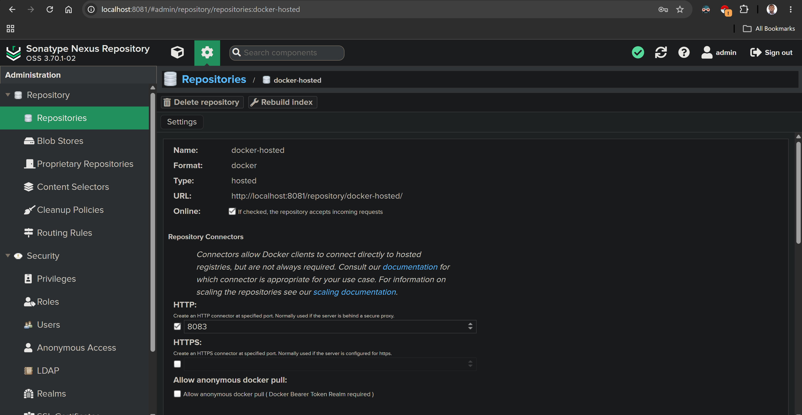

</p>

---

# Understanding the Docker Hosted Repository

A Docker Hosted Repository acts as a private registry where container images are stored and managed.

Unlike Docker Hub, which is publicly accessible by default, a hosted repository provides complete control over who can publish and retrieve images.

Typical workflow:

```text
Docker Client
      │
      ▼
docker login
      │
      ▼
Docker Hosted Repository
      │
      ├──────────────┐
      ▼              ▼
docker push     docker pull
      │              │
      └──────┬───────┘
             ▼
      Stored Docker Images
```

This repository becomes the central source of truth for internally managed container images.

---

# Verify Repository Creation

Before proceeding, verify that the repository has been created successfully.

Confirm the following:

* The repository appears in the repository list.
* The repository status is **Online**.
* The HTTP connector is enabled.
* The configured Docker port is available.
* No configuration errors are displayed.

Completing these checks ensures that the registry is ready to accept Docker client connections.

---

## Deployment Summary

At this stage, the following milestones have been completed:

* Docker Engine verified.
* Persistent Docker volume created.
* Nexus Repository Manager deployed as a container.
* Nexus web interface accessed.
* Initial administrator password retrieved.
* Administrator account configured.
* Docker Hosted Repository created.
* Repository verified and ready for Docker client authentication.

The environment is now prepared for publishing and retrieving Docker images through the private registry.

---

# Configuring Docker Authentication

With the Docker Hosted Repository created and online, the next step is to configure the Docker client so it can communicate securely with Nexus Repository Manager.

Authentication ensures that only authorized users can publish and retrieve container images from the private registry.

---

# Authentication Workflow

```text
Docker Client
      │
      ▼
docker login
      │
      ▼
Nexus Repository Manager
      │
      ▼
Authentication Successful
      │
      ├──────────────┐
      ▼              ▼
docker push     docker pull
```

Once authentication succeeds, the Docker client can interact with the hosted repository.

---

# Step 8: Authenticate the Docker Client

Open a terminal and authenticate against the Docker Hosted Repository.

```bash
docker login localhost:8083
```

When prompted, enter your Nexus credentials.

**Username**

```text
admin
```

**Password**

```text
Your Nexus administrator password
```

If authentication succeeds, Docker displays:

```text
Login Succeeded
```

This confirms that the Docker client is authorized to interact with the private registry.

---

```text
images/docker-login.png
```

<p align="center">

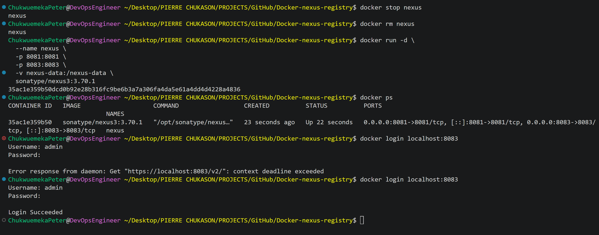

</p>

---

# Step 9: View Local Docker Images

Before publishing an image, inspect the images already available on your local machine.

```bash
docker images
```

Example output:

```text
REPOSITORY      TAG       IMAGE ID       CREATED        SIZE
nginx           latest    xxxxxxxxx      x days ago     xxxMB
ubuntu          latest    xxxxxxxxx      x days ago     xxxMB
node            latest    xxxxxxxxx      x days ago     xxxMB
```

Choose the image that you want to publish to the private registry.

---

```text
images/docker-images.png
```

<p align="center">

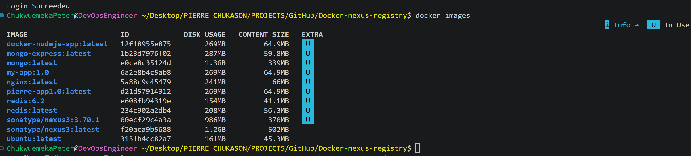

</p>

---

# Understanding Docker Image Tagging

Before an image can be pushed to a private registry, Docker must know where that image belongs.

This is accomplished by assigning a new tag that includes:

* Registry endpoint
* Repository name
* Image name
* Version tag

General format:

```text
<registry>/<repository>/<image>:<tag>
```

Example:

```text
localhost:8083/docker-hosted/nginx:1.0
```

The original image remains unchanged. Docker simply creates another reference that points to the same underlying image.

---

# Step 10: Tag a Docker Image

Create a tag for the image that targets the private registry.

```bash
docker tag nginx:latest \
localhost:8083/docker-hosted/nginx:1.0
```

Verify that the new tag exists.

```bash
docker images
```

The output should now include the newly tagged image alongside the original image.

---

```text
images/docker-tag.png
```

<p align="center">

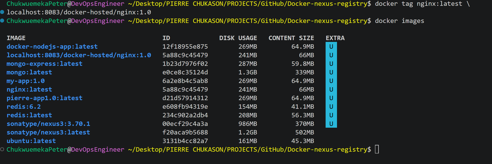

</p>

---

# Step 11: Push the Image to Nexus

Publish the tagged image to the Docker Hosted Repository.

```bash
docker push localhost:8083/docker-hosted/nginx:1.0
```

Docker uploads each image layer individually.

A typical push process looks similar to:

```text
Preparing
Waiting
Pushing Layers
Pushed
Digest Generated
Push Complete
```

After completion, the image is stored inside Nexus Repository Manager.

---

```text
images/docker-push.png
```

<p align="center">

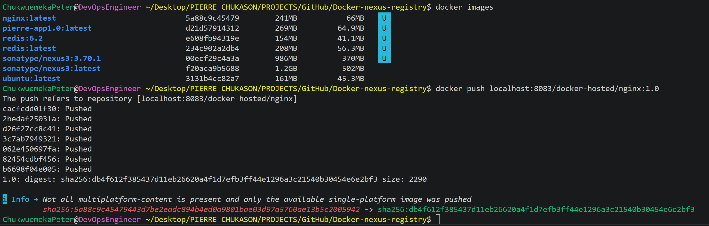

</p>

---

# Verify the Uploaded Image

Open the Nexus web interface and navigate to:

```text
Browse
      │
      ▼
docker-hosted
```

Locate the uploaded image.

Typical information displayed includes:

* Repository name
* Image name
* Version tag
* Digest
* Upload timestamp
* Image layers

Seeing the image listed confirms that the push operation completed successfully.

---

```text
images/repository-images.png
```

<p align="center">

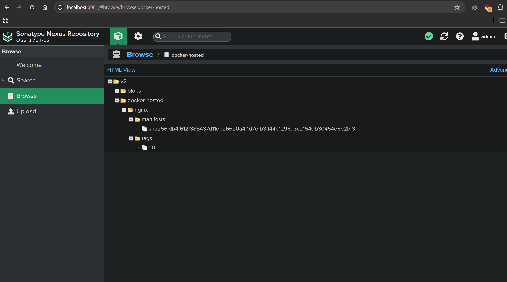

</p>

---

# Step 12: Pull the Image from Nexus

To verify that the registry can distribute stored images, pull the image back from Nexus.

```bash
docker pull localhost:8083/docker-hosted/nginx:1.0
```

Docker downloads the image from the hosted repository.

A successful pull confirms that:

* Authentication is working.
* The repository is accessible.
* The image is available for deployment.

---

```text
images/docker-pull.png
```

<p align="center">

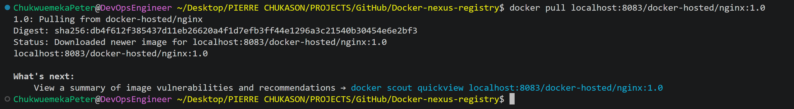

</p>

---

# Step 13: Deploy a Container from the Private Registry

Run a container using the image stored in Nexus.

```bash
docker run -d \
  --name nginx-private \
  -p 8080:80 \
  localhost:8083/docker-hosted/nginx:1.0
```

Verify that the container is running.

```bash
docker ps
```

If the container appears in the output, the deployment has completed successfully.

You can also open your browser and navigate to:

```text
http://localhost:8080
```

If the default Nginx page is displayed, the container is running correctly using the image retrieved from your private registry.

---

```text
images/container-running.png
```

<p align="center">

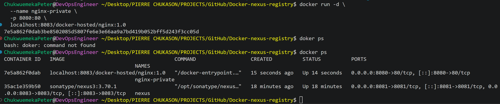

</p>

---

# Complete Image Lifecycle

```text
Build or Pull Image
        │
        ▼
Tag Image
        │
        ▼
docker login
        │
        ▼
Push to Nexus
        │
        ▼
Store in Private Registry
        │
        ▼
Pull from Nexus
        │
        ▼
Run Container
        │
        ▼
Application Running
```

This workflow demonstrates the complete lifecycle of managing Docker images using Nexus Repository Manager as a private Docker registry.

---

# Deployment Verification Checklist

Verify that each of the following tasks has been completed successfully:

* Docker client authenticated with Nexus.
* Local image tagged for the private registry.
* Image pushed successfully.
* Image visible in the Docker Hosted Repository.
* Image pulled successfully.
* Container deployed from the private registry.
* Application accessible through the mapped port.

Completing this checklist confirms that the private registry is fully operational and ready for use.

---

# Repository Management and Best Practices

Deploying a private Docker registry is only the first step. Maintaining a reliable registry requires consistent image management, versioning, security, and operational practices.

This section highlights the practices that improve the maintainability and reliability of a private container registry.

---

# Managing Docker Images

As applications evolve, new container images are continuously created and published. A private registry acts as the central repository for these artifacts throughout the software development lifecycle.

A typical image lifecycle is shown below.

```text
Developer
      │
      ▼
Build Image
      │
      ▼
Tag Image
      │
      ▼
Push to Nexus
      │
      ▼
Store in Repository
      │
      ▼
Pull for Deployment
      │
      ▼
Run Application
      │
      ▼
Publish Updated Version
```

Managing images through a single repository ensures that development, testing, and production environments all use trusted and versioned artifacts.

---

# Image Versioning

Versioning plays an important role in maintaining predictable deployments.

Instead of relying exclusively on the `latest` tag, assign meaningful version numbers to images.

Examples:

```text
nginx:1.0.0
nginx:1.1.0
backend-api:2.0.0
frontend-app:3.4.1
```

Using explicit version tags provides several benefits:

* Easier rollback to previous releases
* Clear deployment history
* Improved release management
* Consistent deployments across environments

---

# Image Tagging Best Practices

Well-structured image tags make repositories easier to maintain.

Common tagging strategies include:

```text
application:1.0.0
application:2.3.1
application:production
application:staging
application:development
```

While the `latest` tag is convenient during development, explicit version tags are generally preferred for production workloads because they make deployments reproducible.

---

# Repository Organization

As the number of stored images grows, organizing repositories becomes increasingly important.

Example:

```text
docker-hosted
│
├── frontend
├── backend
├── database
├── monitoring
├── nginx
└── utilities
```

A logical repository structure improves discoverability and simplifies long-term maintenance.

---

# Security Best Practices

A private registry often stores deployment artifacts that are critical to an organization.

Recommended practices include:

* Require authentication for registry access.
* Use strong administrator credentials.
* Disable anonymous access unless it is intentionally required.
* Assign appropriate permissions to users.
* Keep Nexus Repository Manager updated.
* Regularly review stored images.
* Remove obsolete artifacts when they are no longer needed.
* Back up persistent repository data.

Applying these practices helps protect container images and supports a more secure software supply chain.

---

# Operational Best Practices

During this implementation, several operational practices were followed.

* Store Nexus data in a persistent Docker volume.
* Use descriptive repository names.
* Apply consistent image tagging conventions.
* Verify image uploads after every push.
* Confirm successful image pulls before deployment.
* Document deployment procedures.
* Monitor storage usage over time.
* Clean up unused Docker resources periodically.

These practices improve reliability and make the environment easier to manage.

---

# Monitoring Repository Health

Regular monitoring helps identify issues before they affect deployments.

Areas worth monitoring include:

* Docker container status
* Repository availability
* Storage utilization
* Image uploads and downloads
* Authentication failures
* Docker daemon health
* Available disk space

Routine monitoring contributes to a stable and dependable registry.

---

# Backup Considerations

Repository data is stored inside the persistent Docker volume.

A simple backup strategy is illustrated below.

```text
Nexus Repository
        │
        ▼
Docker Volume
        │
        ▼
Scheduled Backup
        │
        ▼
Secure Storage
        │
        ▼
Recovery
```

Backing up the persistent volume preserves repository configuration, metadata, and stored Docker images.

---

# Cleanup

After completing testing, remove resources that are no longer required.

Remove the Nexus container.

```bash
docker rm -f nexus
```

Remove unused containers.

```bash
docker container prune
```

Remove unused images.

```bash
docker image prune
```

Remove unused Docker resources.

```bash
docker system prune
```

Display Docker disk usage.

```bash
docker system df
```

If the repository is no longer needed, remove the persistent Docker volume.

```bash
docker volume rm nexus-data
```

---

```text
images/cleanup.png
```

<p align="center">

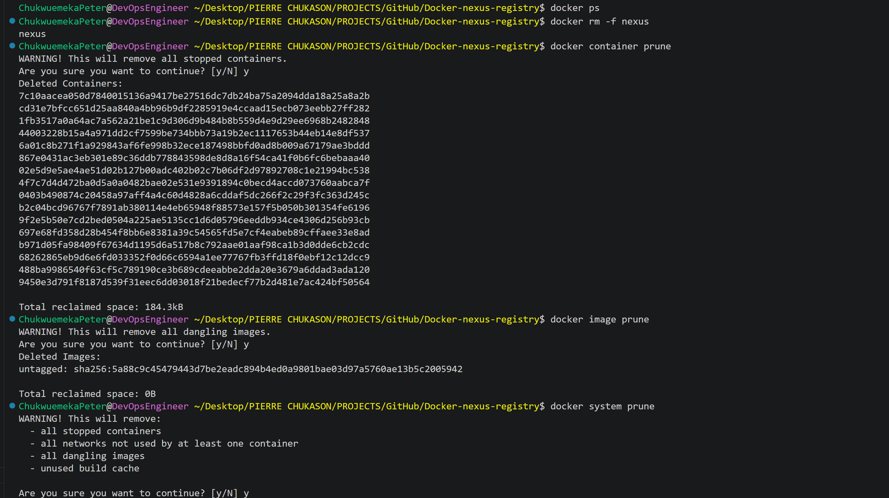

</p>

---

# Common Challenges

| Challenge                                | Possible Resolution                                                           |
| ---------------------------------------- | ----------------------------------------------------------------------------- |
| Unable to access the Nexus web interface | Verify that the Nexus container is running and port 8081 is mapped correctly. |
| Docker login fails                       | Confirm the repository port, username, and password.                          |
| Image push is denied                     | Verify authentication and repository permissions.                             |
| Image cannot be pulled                   | Check the image tag and repository endpoint.                                  |
| Nexus container stops unexpectedly       | Inspect the container logs using `docker logs nexus`.                         |
| Repository does not appear               | Verify that the Docker Hosted Repository was created successfully.            |

---

# Learning Outcomes

Completing this project provided practical experience with:

* Deploying Nexus Repository Manager in Docker.
* Configuring a private Docker registry.
* Creating Docker Hosted Repositories.
* Authenticating Docker clients.
* Tagging Docker images for private registries.
* Publishing container images.
* Retrieving images from a private registry.
* Deploying containers from trusted artifacts.
* Managing persistent Docker volumes.
* Documenting infrastructure projects professionally.

---

# Future Improvements

Possible enhancements for this project include:

* Integrating Nexus with CI/CD pipelines.
* Configuring HTTPS using TLS certificates.
* Introducing reverse proxy support with Nginx.
* Implementing role-based access control.
* Adding automated image vulnerability scanning.
* Integrating with Kubernetes.
* Automating repository backups.
* Monitoring Nexus with observability tools such as Prometheus and Grafana.
* Deploying the registry on cloud infrastructure for production use.

---

# Project Summary

This project demonstrates the deployment and configuration of **Sonatype Nexus Repository Manager** as a private Docker registry running in a local Docker environment.

The implementation covered the complete lifecycle of container image management, including deploying Nexus, configuring a Docker Hosted Repository, authenticating Docker clients, tagging images, publishing images, retrieving them from the registry, and deploying containers using trusted artifacts.

Beyond the implementation itself, the project reinforced key DevOps concepts such as artifact management, image versioning, persistent storage, authentication, documentation, and operational best practices.

Although this implementation was performed in a local environment, the same workflow forms the foundation for enterprise container registries used within CI/CD pipelines and production platforms.

---

# Connect With Me

If you found this repository helpful or would like to discuss Docker, DevOps, Cloud Engineering, Infrastructure Automation, or Software Supply Chain Management, feel free to connect.

* **GitHub:** https://github.com/Chukwuemeka-Peter-Eze
* **LinkedIn:** https://www.linkedin.com/in/chukwuemekapetereze/
* **Notion:** https://lumpy-bubble-7b0.notion.site/Containers-with-Docker-3a546a96f97480a88041ff2ff82a6b5f

If you found this project useful, consider giving it a ⭐ to support the repository.
